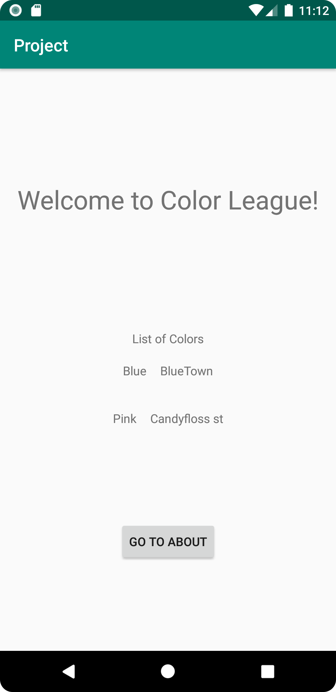
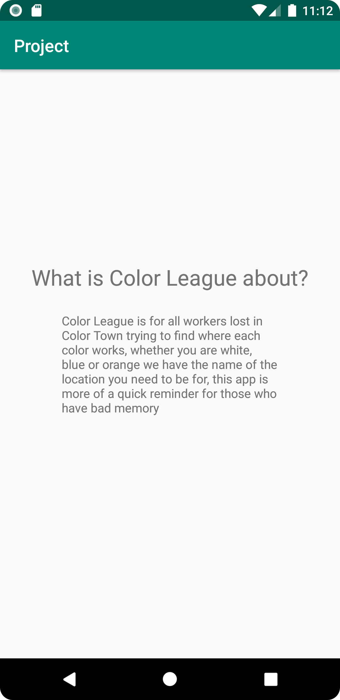

# Rapport

Skapat recyclerview (klass och XML) + en recyclerview adapter
(som kopplar datan till RecyclerView:n) samt en color klass
för att kunna överföra JSON arrayen med hjälp av Gson som ska nå en API
med alla färger som skapats i API:n via admingränsnittet
så att det visas i RecyclerView:n (Både namnet på färg och platsen visas).
även lagt till knapp som använder sig utav intents för att gå över till
about sida som innehåller information om målgrupp och generellt om sidan

Kod:
```
Main Activity Kod:
OBS! ENDAST DEN RELEVANTA KODEN VISAS. 
EJ KOD EMELLAN
    
    private final String JSON_URL = "https://mobprog.webug.se/json-api?login=a23elism";

    ArrayList<Color> Colors= new ArrayList<>();
    Gson gson = new Gson();

    String json = gson.toJson(Colors);
    
    
    protected void onCreate(Bundle savedInstanceState) {
    
        goToAboutActivity();

        new JsonTask(this).execute(JSON_URL);
    }
    
    @Override
    public void onPostExecute(String json) {
        Log.d("MainActivity", json);
        Type type = new TypeToken<ArrayList<Color>>() {}.getType();
        ArrayList<Color> Colors = gson.fromJson(json, type);

        RecyclerView RecyclerView = findViewById(R.id.recyclerView);

        RecyclerViewAdapter adapter = new RecyclerViewAdapter (this, Colors);
        RecyclerView.setAdapter(adapter);
        RecyclerView.setLayoutManager(new LinearLayoutManager(this));
        adapter.notifyDataSetChanged();
    }

    private void goToAboutActivity() {
        Button btn = (Button) findViewById(R.id.about);
        btn.setOnClickListener(new View.OnClickListener() {
            @Override
            public void onClick(View view) {
                Intent intent = new Intent(MainActivity.this, AboutActivity.class);
                startActivity(intent);
            }
        });
    }
```

```
RecyclerViewAdapter Kod:
OBS! endast program koden visas ej XML koden för RecyclerView
Det blir svårt att minimera koden för RecyclerViewAdapter så hela klassen står med

    public class RecyclerViewAdapter extends RecyclerView.Adapter<RecyclerViewAdapter.MyViewHolder> {
        Context context;
        ArrayList<Color> Colors;
    
        public RecyclerViewAdapter(Context context, ArrayList<Color> Colors) {
            this.context = context;
            this.Colors = Colors;
        }
    
        @NonNull
        @Override
        public RecyclerViewAdapter.MyViewHolder onCreateViewHolder(@NonNull ViewGroup parent, int viewType) {
            LayoutInflater inflater = LayoutInflater.from(context);
            View view = inflater.inflate(R.layout.recycler_layout, parent, false);
            return new RecyclerViewAdapter.MyViewHolder(view);
        }
    
        @Override
        public void onBindViewHolder(@NonNull RecyclerViewAdapter.MyViewHolder holder, int position) {
            Color color = Colors.get(position);
            holder.colorNameTextView.setText(color.getName());
            holder.colorLocationTextView.setText(color.getLocation());
        }
    
        @Override
        public int getItemCount() {
            return Colors.size();
        }
    
        public static class MyViewHolder extends RecyclerView.ViewHolder {
            TextView colorNameTextView;
            TextView colorLocationTextView;
    
            public MyViewHolder(@NonNull View itemView) {
                super(itemView);
                colorNameTextView = itemView.findViewById(R.id.colorName);
                colorLocationTextView = itemView.findViewById(R.id.colorLocation);
            }
        }
    }

```

Bilder:

MainActivity/Home Page (OBS! svårt att visa scroll i en bild)


About Page
